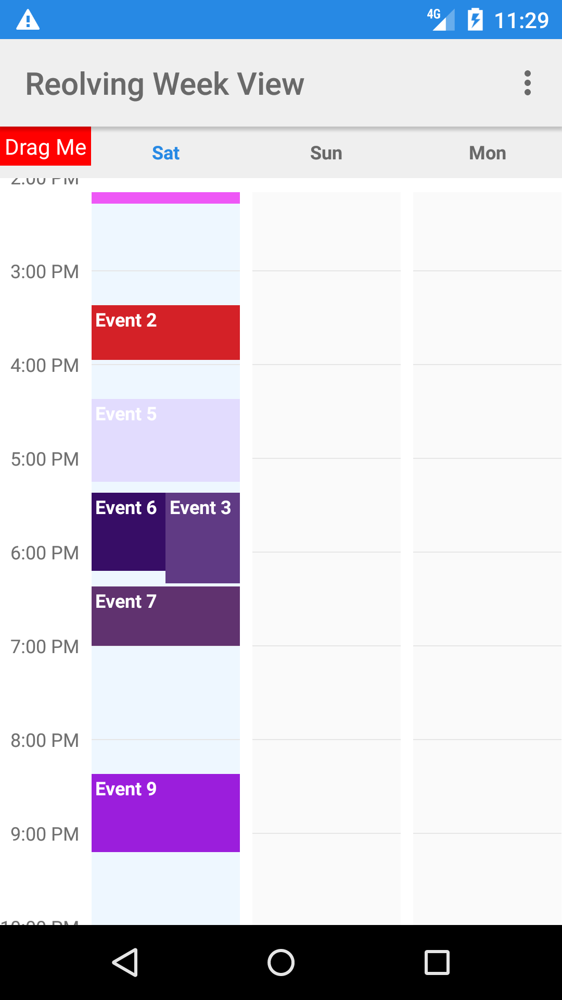

Revolving Week View (Android)
===

**Android Week View** is an android library to display a static week calendar with options of viewing 1-7 days of the week at a time.

	

Features
---

* Choose from 1-7 viewing days
* Custom styling
* Vertical scrolling and zooming
* Possibility to set min and max day of the week
* Possibility to set range of visible hours
* All day events at the top
* Live preview of custom styling in xml preview window

Sample
---

There is also a [sample app](https://github.com/jlurena/revolvingweekview/tree/master/sample) to get you started.

Special Thanks and Credits
---
* Original author [Raquib-ul Alam (Kanak)](https://github.com/alamkanak) and the widget this library is based off  [Android-Week-View](https://github.com/alamkanak/Android-Week-View)
* [Quivr](https://github.com/Quivr)'s fork https://github.com/Quivr/Android-Week-View
* The Github community and everyone that contributed to Android-Week-View.

The MIT License (MIT)
=====================

Copyright © `2018` `Jean Luis Urena`

Permission is hereby granted, free of charge, to any person
obtaining a copy of this software and associated documentation
files (the “Software”), to deal in the Software without
restriction, including without limitation the rights to use,
copy, modify, merge, publish, distribute, sublicense, and/or sell
copies of the Software, and to permit persons to whom the
Software is furnished to do so, subject to the following
conditions:

The above copyright notice and this permission notice shall be
included in all copies or substantial portions of the Software.

THE SOFTWARE IS PROVIDED “AS IS”, WITHOUT WARRANTY OF ANY KIND,
EXPRESS OR IMPLIED, INCLUDING BUT NOT LIMITED TO THE WARRANTIES
OF MERCHANTABILITY, FITNESS FOR A PARTICULAR PURPOSE AND
NONINFRINGEMENT. IN NO EVENT SHALL THE AUTHORS OR COPYRIGHT
HOLDERS BE LIABLE FOR ANY CLAIM, DAMAGES OR OTHER LIABILITY,
WHETHER IN AN ACTION OF CONTRACT, TORT OR OTHERWISE, ARISING
FROM, OUT OF OR IN CONNECTION WITH THE SOFTWARE OR THE USE OR
OTHER DEALINGS IN THE SOFTWARE.